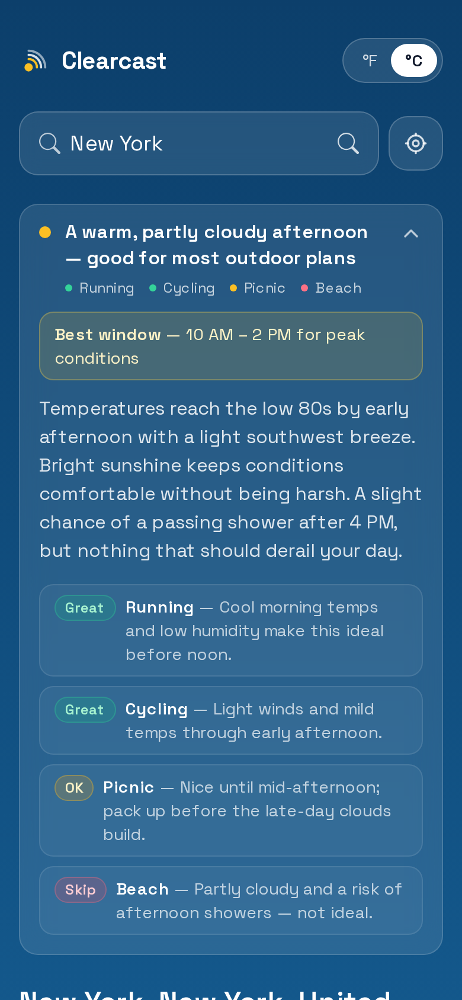
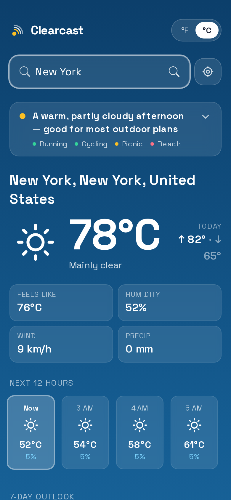

# Clearcast

A weather app that answers **"what can I actually do today?"** — not just temperature and
an icon, but a short, AI‑written recommendation: *"Light jacket. Dry until 9pm — good run
window 6–8pm. Skip the bike, gusts pick up after lunch."*

Clearcast pulls a live forecast, sends a trimmed slice of it to Claude through a
serverless function, and renders a plain‑English plan: what to wear, which activities are
**great / ok / skip**, and the best time window — on an **Adaptive Sky** UI whose
background shifts with the current conditions and time of day.

## Features

- **AI recommendation** — the forecast becomes a decision, not a data dump. Structured,
  schema‑validated output (headline, summary, per‑activity verdict, best window).
- **Adaptive Sky** — the background gradient reflects the current conditions (clear, cloud,
  rain, snow, fog, storm) and day/night.
- **Geolocation + search** — uses the browser location (reverse‑geocoded to a real city
  name) with a manual city search fallback.
- **Locale‑aware units** — defaults to °F/mph in the US and °C/km·h elsewhere, with a
  manual toggle that's remembered.
- **Cheap & fast** — the AI response is cached per `lat,lon,hour`, and a daily call cap
  bounds cost. The Claude key never leaves the server.
- **Installable, offline-first PWA** — installable to the home screen; the service worker
  precaches the app shell and serves the last forecast when there's no signal.

## Tech stack

| Layer | Choice |
|---|---|
| Framework | **Next.js** (pages router) + **React** + **TypeScript** (strict) |
| Styling | **Tailwind CSS** |
| Weather data | **Open‑Meteo** (no API key) + **BigDataCloud** reverse geocoding |
| AI | **Claude `claude-haiku-4-5`** via a Next.js API route (`@anthropic-ai/sdk` + Zod structured output) |
| Tests | **Vitest** + React Testing Library |
| CI/CD | **GitHub Actions** (lint → typecheck → test → build) |
| Hosting | **Netlify** (Next.js runtime; API route runs as a serverless function) |

## Architecture

```
Browser (Next.js)
  ├─ navigator.geolocation ──► reverse geocode (BigDataCloud) ──► city + country
  ├─ GET api.open-meteo.com/forecast ─────────────────────────► forecast JSON
  └─ POST /api/summarize { trimmedForecast, lat, lon } ───────► Next.js API route
                                                                 ├─ cache (lat,lon,hour)
                                                                 ├─ daily call cap
                                                                 └─ Claude (claude-haiku-4-5)
                                                                    + Zod structured output
  ◄─ render: statline recommendation ▸ current ▸ hourly ▸ 7-day, over the Adaptive Sky
```

The Claude API key is read only inside `pages/api/summarize.ts` (server‑side) and is never
included in the client bundle.

## Getting started

```bash
# 1. Install
yarn install

# 2. Configure the AI key (see Environment variables)
cp .env.example .env.local
# then edit .env.local and paste your sk-ant-... key

# 3. Run
yarn dev   # http://localhost:3000
```

Without `ANTHROPIC_API_KEY` the app still works — it shows the forecast and a graceful
"recommendation unavailable" notice instead of the AI hero.

## Environment variables

| Variable | Required | Notes |
|---|---|---|
| `ANTHROPIC_API_KEY` | for the AI hero | Server‑only. Get it from the [Anthropic Console](https://console.anthropic.com). Never prefix with `NEXT_PUBLIC_`. |
| `MAX_AI_CALLS_PER_DAY` | no | Daily cap on Claude calls (default `500`). Bounds cost. |

## Scripts

```bash
yarn dev        # local dev server
yarn build      # production build
yarn lint       # ESLint
yarn typecheck  # tsc --noEmit (strict)
yarn test       # Vitest
yarn coverage   # Vitest with coverage

node scripts/generate-icons.mjs  # regenerate PWA icons from public/icon.svg
```

## Testing

Vitest + React Testing Library cover the parts most worth protecting: the
forecast→prompt trimming, the recommendation schema parsing, the Open‑Meteo response
mapping, the unit‑system / locale logic, the sky‑category mapping, and the recommendation
UI. Run `yarn test`.

## Deployment (Netlify)

1. **Add new site → Import from GitHub** → pick this repo, deploy branch `main`.
2. Netlify auto‑detects Next.js (`netlify.toml` pins the build + Node version and enables
   the Next.js runtime, which turns `/api/summarize` into a serverless function).
3. **Site settings → Environment variables** → add `ANTHROPIC_API_KEY` (and optionally
   `MAX_AI_CALLS_PER_DAY`). Redeploy so the function picks it up.

## Screenshots

| Recommendation (expanded) | Adaptive Sky |
|---|---|
|  |  |
