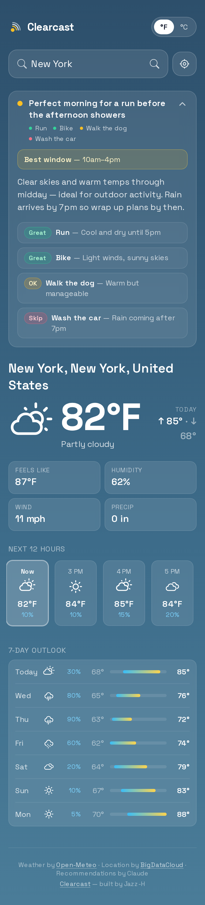
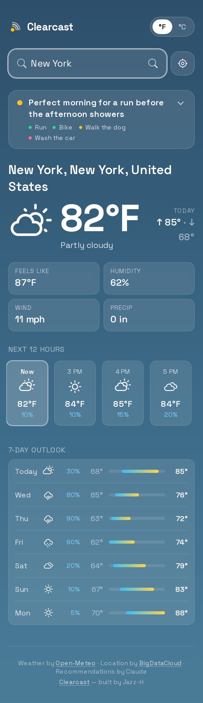
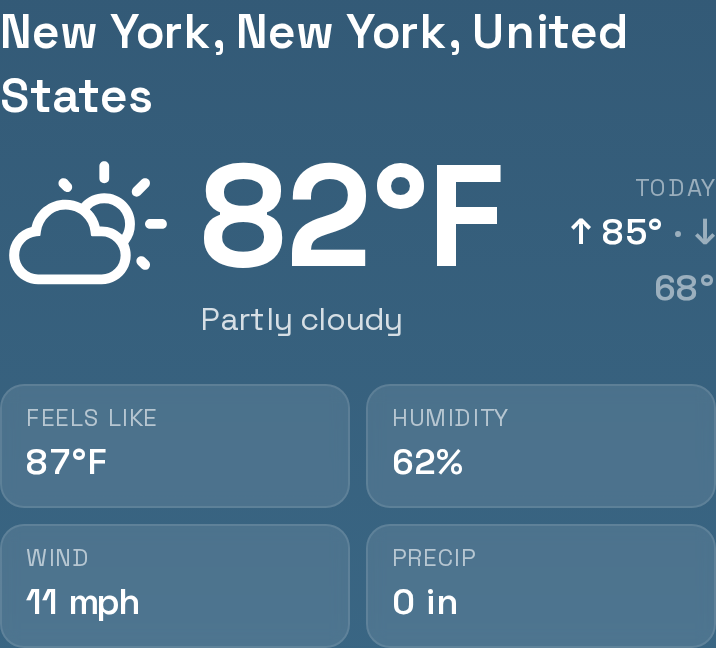
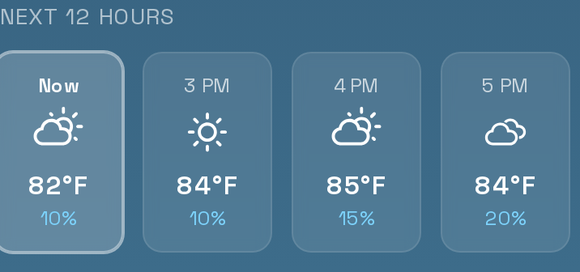
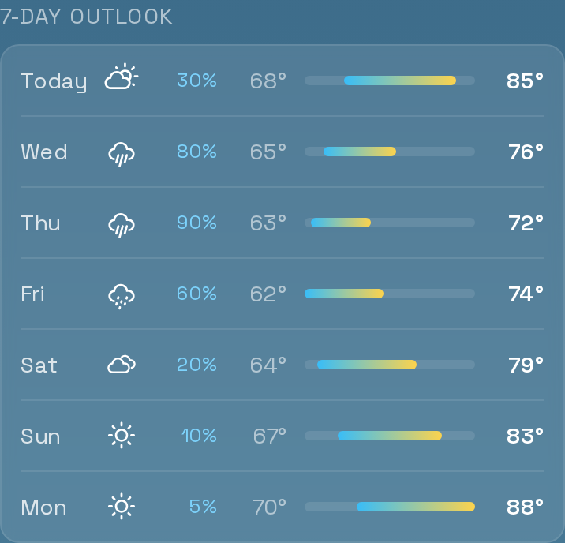
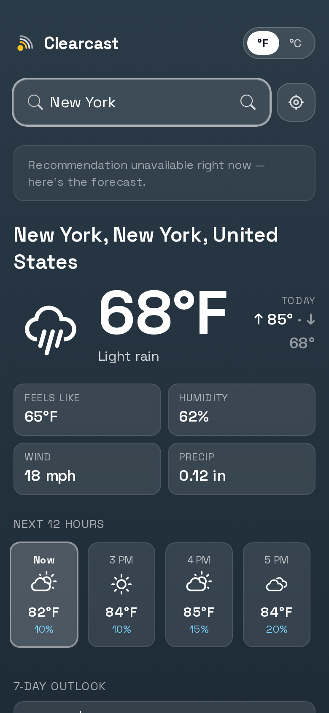
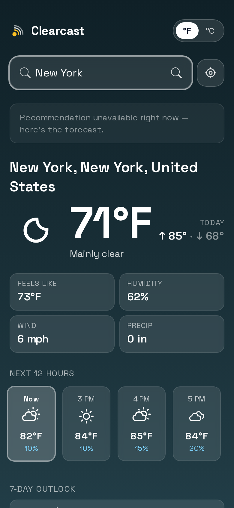
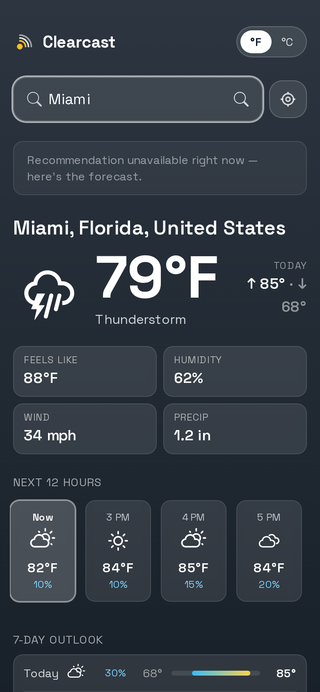
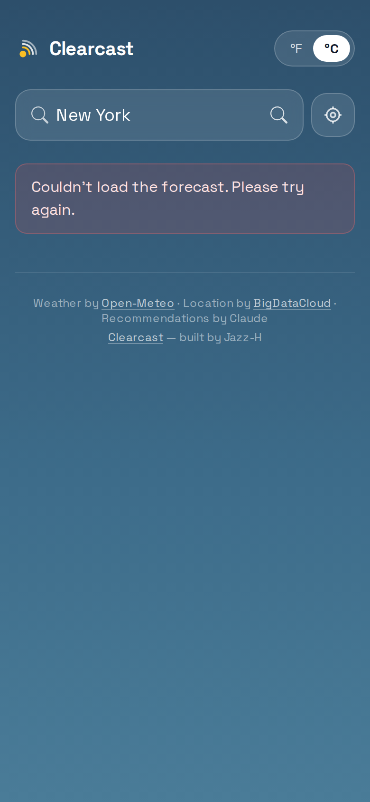
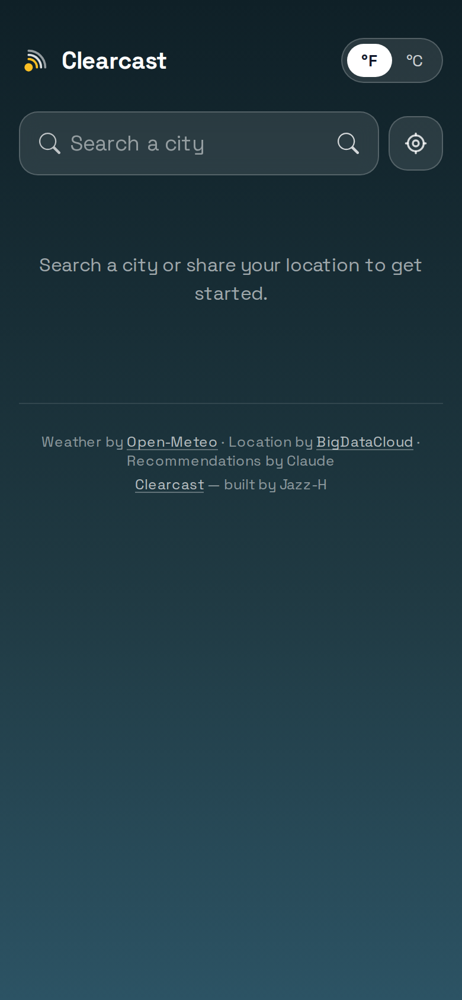

# Clearcast — Portfolio Work Detail

## Project Overview

**Clearcast** is a production-ready, full-stack weather PWA that turns a raw forecast into a plain-English plan for your day. It integrates Claude AI for structured activity recommendations, adapts its visual theme to live weather conditions, and works offline as an installable app. Every layer — from API design to caching strategy to unit detection — is built for correctness, not just demo appeal.

**Live stack:** Next.js 13 · React 18 · TypeScript (strict) · Tailwind CSS · Claude Haiku 4.5 · Open-Meteo · Zod · Vitest · Playwright · PWA · Netlify

---

## Key Features

### AI-Powered Daily Recommendation
The hero card calls Claude Haiku via a server-only API route and returns structured JSON — a headline, plain-English summary, 3–4 activity verdicts (great / ok / skip with reasons), and the best time window. Zod validates the model's output at runtime so a bad response surfaces as a handled 502, not a client crash. The card is collapsed by default showing just the headline and colour-coded verdict pills; clicking expands full detail with `aria-expanded` wired for screen readers.

### Adaptive Sky Backgrounds
Eight CSS gradient themes — clear day, clear night, cloud day/night, fog, rain, snow, storm — shift automatically based on the current WMO weather code and `is_day` flag. All gradients are tuned to maintain WCAG AA contrast for white text.

### Smart Unit Detection
Defaults to °F / mph for US (including territories) and °C / km/h everywhere else, derived from the ISO 3166-1 alpha-2 country code returned by geocoding. Falls back to the browser's BCP-47 locale region subtag if no country code is available. The user's manual toggle is persisted to localStorage with a separate "manual" flag so auto-detection doesn't clobber an explicit choice on the next search.

### Current Conditions
Large temperature, apparent temperature, humidity, wind speed, precipitation, today's high/low, and a WMO-mapped weather icon (day/night aware). Location displayed as a breadcrumb (city, region, country) with `break-words` to handle long names cleanly.

### Hourly Strip
12-hour horizontal snap-scroll showing time, icon, temperature, and precipitation probability. The current hour is labelled "Now". Custom scrollbar styling matches the glass card design.

### 7-Day Outlook
Each of the 7 rows shows weekday label, icon, precip probability, and a temperature range bar. Bars are normalized across the week's absolute min/max — so the visual widths represent real relative magnitude, not arbitrary percentages.

### Progressive Web App
Installable on iOS and Android. Service worker precaches the app shell and serves the last-seen forecast when offline (NetworkFirst strategy). Safe-area padding respects notches and home indicators. Icons generated from a single SVG source via Sharp (192px, 512px, maskable, Apple touch).

---

## Engineering Highlights

| Area | Decision |
|------|----------|
| **LRU Cache** | 500-entry in-memory cache using JS Map's insertion-order guarantee. Evicts oldest entry on overflow; promotes on hit via delete-then-reinsert. O(1) both ways. |
| **Prompt trimming** | `buildPromptPayload()` sends only current conditions + next 12 hours to Claude, cutting payload from ~20 KB to ~2 KB and reducing latency + cost. |
| **Daily call cap** | Module-level counter resets at UTC midnight; returns 429 when exceeded. Configurable via `MAX_AI_CALLS_PER_DAY` env var. |
| **Geocoding fallback chain** | Browser geolocation → BigDataCloud reverse geocode → bare coordinates. Each step degrades gracefully; no hard failures. |
| **Silent geo on mount** | `useEffect` attempts geolocation silently. If denied, sets `status: "idle"` — no error banner. The explicit location button still shows the error on denial. |
| **Zod as single source of truth** | One schema in `lib/recommendationSchema.ts` drives both server-side Claude output parsing and client-side TypeScript types via `z.infer<>`. |
| **Week-normalized range bars** | Daily high/low bars scale to the week's absolute min/max so their widths carry real information. A 4% floor prevents bars from disappearing. |
| **TypeScript strict mode** | `strict: true` across the entire codebase. All component props, API responses, and domain types are explicitly typed. |

---

## Tech Stack

| Layer | Technology |
|-------|-----------|
| Framework | Next.js 13 (Pages Router) |
| Language | TypeScript 5.4 (strict) |
| UI | React 18, Tailwind CSS 3.4 |
| AI | Anthropic Claude Haiku 4.5 via `@anthropic-ai/sdk` |
| Schema validation | Zod 4.4 |
| Weather API | Open-Meteo (no key required) |
| Reverse geocoding | BigDataCloud (no key required) |
| HTTP client | Axios |
| PWA | @ducanh2912/next-pwa + Sharp |
| Unit tests | Vitest 2 + React Testing Library 14 |
| E2E / smoke tests | Playwright 1.56 |
| CI/CD | GitHub Actions → Netlify |

---

## Test Coverage

38 unit tests across 10 files covering data parsing, business logic, and UI behaviour:

- **API parsing** — geocoding and forecast response shape transformations
- **Unit detection** — Fahrenheit countries (US + territories), metric fallback, locale BCP-47 parsing
- **Prompt trimming** — hourly slicing, weather code translation, cache key stability within an hour
- **Sky theme** — WMO code → gradient mapping, day/night branching, unknown code default
- **Format utils** — `round()`, `percentInRange()`, `upcomingHours()` edge cases
- **Schema validation** — valid Claude output, null `bestWindow`, enum enforcement, missing field errors
- **Components** — `CurrentConditions` renders, `RecommendationHero` expand/collapse interaction

---

## Screenshots

### Full App — Hero Expanded
AI recommendation visible with activity verdicts and best-time callout. Clear-day sky gradient.

---

### Full-Page Overview
All sections rendered in one scroll: hero, current conditions, hourly strip, 7-day outlook.

---

### Current Conditions
Location breadcrumb, large temperature, condition icon, and 4-stat grid (humidity, wind, precipitation, feels-like).

---

### Hourly Strip
12-hour horizontal scroll. "Now" card highlighted, icons adapt to each hour's weather code.

---

### 7-Day Outlook
Normalized range bars show relative temperature spread across the week at a glance.

---

### Rain Sky Theme
Moody blue-grey gradient activates for rain weather codes; the background is always in sync with live conditions.

---

### Night Sky Theme
Deep navy gradient for clear-night conditions.

---

### Storm Sky Theme
Dark gradient for thunderstorm codes; Miami example.

---

### Metric Units (°C / km/h)
Unit toggle in header; preference saved to localStorage and survives page reloads.

---

### Idle / Landing State
Clean prompt before any location is selected — no cluttered default data.

